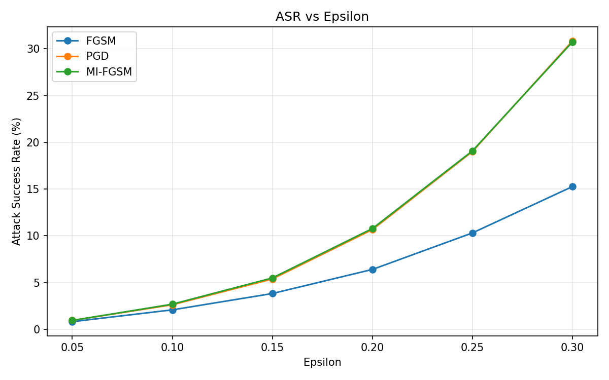
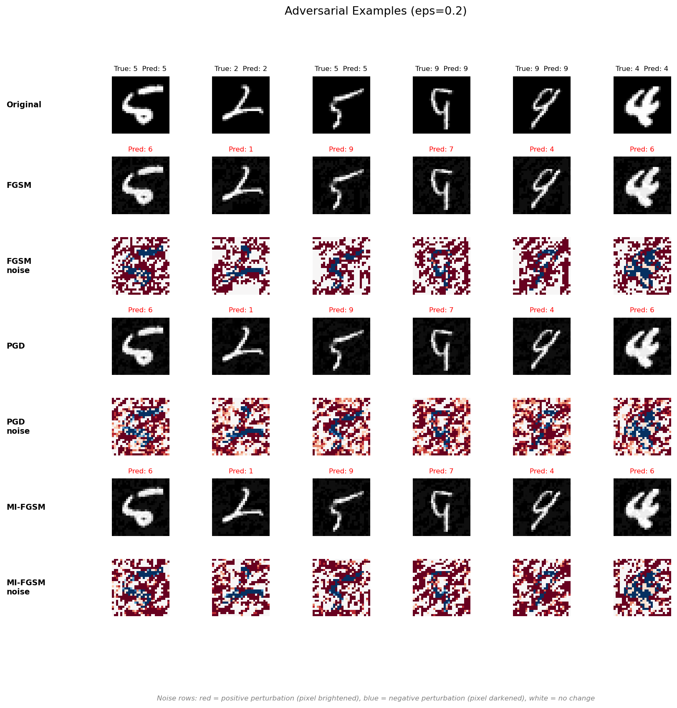

# Adversarial Attacks on MNIST CNN

This project implements three adversarial attack methods against a CNN trained on MNIST handwritten digits.

## Model

- **Architecture:** Conv2d(1,16) -> ReLU -> MaxPool -> Conv2d(16,32) -> ReLU -> MaxPool -> Flatten -> Linear(1568,128) -> ReLU -> Linear(128,10)
- **Training:** Adam optimizer, lr=1e-3, 10 epochs, batch_size=128
- **Clean test accuracy (recognition rate): 98.95%**

## Attack Methods

### 1. FGSM (Fast Gradient Sign Method)

Single-step attack that computes the gradient of the loss w.r.t. the input and takes an epsilon-sized step in the sign direction. Fast but less effective since it only uses a linear approximation of the loss surface.

### 2. I-FGSM / PGD (Projected Gradient Descent)

Iterative version of FGSM with smaller step size, projecting back into the epsilon-ball after each step. Includes random initialization within the epsilon-ball (PGD variant). Stronger than FGSM but proportionally slower.

### 3. MI-FGSM (Momentum Iterative FGSM)

Adds momentum accumulation across iterations to stabilize gradient direction (Dong et al., 2018). Similar white-box attack strength to PGD, but produces more transferable adversarial examples across models.

## Results

### Attack Success Rate (ASR)

ASR = fraction of correctly-classified samples whose prediction flips after the attack.

| Epsilon | FGSM   | PGD     | MI-FGSM |
|---------|--------|---------|---------|
| 0.05    | 0.81%  | 0.94%   | 0.94%   |
| 0.10    | 2.07%  | 2.62%   | 2.68%   |
| 0.15    | 3.82%  | 5.38%   | 5.49%   |
| 0.20    | 6.40%  | 10.66%  | 10.77%  |
| 0.25    | 10.31% | 19.02%  | 19.09%  |
| 0.30    | 15.27% | 30.85%  | 30.75%  |

### ASR vs Epsilon

### Adversarial Examples

## Key Observations

1. **PGD and MI-FGSM are significantly stronger than FGSM.** At epsilon=0.3, the iterative methods achieve ~31% ASR compared to FGSM's ~15%. The iterative refinement finds more effective perturbations than a single gradient step.

2. **MI-FGSM and PGD perform nearly identically** on this model/dataset. The momentum term doesn't provide much additional benefit for a direct white-box attack. Its main advantage (better transferability to other models) isn't tested here.

3. **The CNN is fairly robust at small epsilon values.** Even at epsilon=0.15, all three attacks stay below 6% ASR, suggesting the model's decision boundaries are reasonably distant from the test samples in most cases.

4. **ASR scales super-linearly with epsilon.** Doubling epsilon from 0.15 to 0.30 roughly quadruples ASR for the iterative methods (5.4% to 30.9%), indicating a phase-transition-like behavior as perturbations grow large enough to cross decision boundaries.

